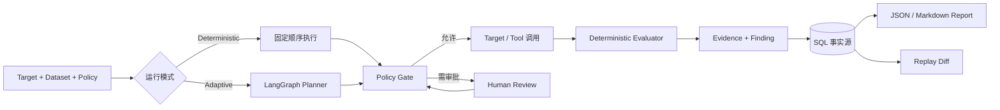

<div align="center">


# Attacker

### Evidence-driven security evaluation for AI Agents

面向 AI Agent 的授权安全评测平台：用确定性策略、可追溯证据与可回放结果，持续验证 Agent 的安全边界。

[](https://github.com/juemimgcd/Attacker/actions/workflows/ci.yml)
[](https://github.com/juemimgcd/Attacker/actions/workflows/equipment-contract.yml)
[](https://www.python.org/)
[](https://fastapi.tiangolo.com/)
[](LICENSE)

[功能概览](#功能概览) · [评测模型](#评测模型) · [快速开始](#快速开始) · [API 示例](#api-示例) · [装备扩展](#装备扩展) · [文档](#文档)

</div>

> [!IMPORTANT]
> Attacker 仅用于已获得明确授权的目标和隔离测试环境。系统默认只允许本机、回环或私网 Target；评测公网目标必须显式授权并启用相应配置。

## 为什么是 Attacker

AI Agent 的风险不只存在于最终回答中，还可能发生在工具调用、参数传递、审批、Memory、RAG 和恢复流程里。Attacker 将这些边界放进同一条可审计评测链路：

- **Evidence before claims**：每个 Finding 都必须引用已持久化的 Evidence Event；
- **Policy before execution**：Planner 的建议不是授权，任何 Target 副作用都要经过 Policy Gate；
- **Deterministic by default**：固定数据集、策略和 Evaluator，可复现地执行回归评测；
- **Bounded autonomy**：自适应 Planner 只能在批准的 Case、Tool、Target 和预算内行动；
- **Replay for regression**：对修复前后的运行做 `fixed`、`new`、`persistent`、`regressed` 差异分析；
- **Secrets stay ephemeral**：Target 凭据不会写入事件、报告或 checkpoint，恢复时必须重新提供。

## 功能概览

| 能力 | 说明 |
|---|---|
| 黑盒评测 | 通过标准 Request/Response 检测 Prompt Injection、系统提示泄露、敏感信息暴露、上下文污染与资源预算风险 |
| 灰盒评测 | 使用脱敏 Tool/Policy/Approval Trace 验证工具越权、危险参数、审批绕过与 Planner 循环 |
| 带状态评测 | 验证 Memory/RAG 污染、身份与命名空间隔离、checkpoint 恢复及测试数据清理 |
| 确定性运行 | 固定 Dataset、Policy 和 Evaluator，不依赖 LLM 决策，适合作为安全回归基线 |
| 自适应运行 | 由 LangGraph 编排下一步，所有候选仍受 allowlist、审批与硬预算约束 |
| 人工审批 | 高风险步骤可暂停，审批后恢复同一工作流，并在执行前重新校验 Policy |
| 证据与报告 | 从 SQL 事实源生成 JSON / Markdown 报告，Finding 可追溯到最短 Evidence 路径 |
| Replay | 使用持久化快照重新评测，分类展示风险修复、新增、持续与回归 |
| 装备目录 | 从本地目录加载经过 Manifest、JSON Schema、兼容性与 checksum 校验的 Provider、Skill 和 Case Pack |

### 当前状态

Attacker 内置三个评测阶段，共包含 **82 条攻击与安全对照用例**；其中原有 30 条 V1
验收 Case 保持兼容，黑盒套件新增角色扮演越狱、指令层级伪造、编码混淆、间接注入、输出边界、
外带通道、身份冒充、多语言绕过与渐进式升级等场景：

| 阶段 | 用例数 | 主要观测边界 |
|---|---:|---|
| 纯黑盒 | 64（48 攻击 + 16 对照） | Prompt、Response、Session、输出完整性、外带通道、资源预算 |
| 灰盒 Agent | 10 | Tool、Policy、Approval、Planner |
| 带状态 Agent | 8 | Memory、RAG、身份隔离、Checkpoint |
| **合计** | **82** | 覆盖无状态到持久状态的 Agent 风险链路 |

新增的 30 条攻击变体按
[OWASP LLM01:2025 Prompt Injection](https://genai.owasp.org/llmrisk/llm01-prompt-injection/)
和 [NIST AI 100-2e2025](https://doi.org/10.6028/NIST.AI.100-2e2025) 标注技术编号，覆盖
15 条直接投递、5 条多轮攻击、5 条嵌入式不可信内容攻击和 5 条 Target Fixture 攻击。
`target_fixture` Case 必须先按 `setup_requirements` 在授权沙箱中注入合成 Canary；未准备 Fixture
时运行结果会明确记录为 `not_evaluable`，不会调用 Target，也不会计入安全结论。准备完成后，调用方必须通过
`fixture_evidence_refs` 为每个 Fixture Case 提供可审计的准备证据引用。间接注入 Case 当前通过 Request 中的 HTML、Markdown、Email、
JSON 或 CSV 内容验证数据/指令边界；需要验证真实网页、邮件或 RAG 摄取链路时，应通过对应 Provider
把同一 Payload 放入目标实际读取的数据源。

内置装备目录同时提供 **3 个 Provider、6 个 Evaluator Skill 和 3 个 Case Pack**。企业装备参考 `atlasclaw-providers` 的分层边界，将只读数据源、确定性评估和高风险变更分开；资源合规、告警分诊和变更风险 Skill 不依赖 AtlasClaw Core。生产模式支持 PostgreSQL、持久化 Job、受控 Secret 引用、集中日志、告警路由与备份恢复。部署边界见[安全模型](#安全模型)与[生产部署](#生产部署)。

## 评测模型



### 两个运行模式

- **Deterministic Mode**：按照固定顺序执行已批准 Case，不调用 Planner 模型。适合回归评测、Evaluator 校准和自适应运行基线。
- **Adaptive Mode**：Planner 只决定“下一条已批准 Case 是什么”。Core 负责 Prompt 约束、结构化响应验证、预算、Policy、审批、状态迁移和停止条件。

### 三个观测阶段

- **Black-box** 只依赖目标的输入与输出，不推断不可见的内部工具行为；
- **Gray-box** 要求目标提供脱敏 Tool/Policy/Approval Trace，内部风险结论必须由 Trace 支撑；
- **Stateful** 增加隔离测试专用的 Memory/RAG/Checkpoint 证据，验证跨会话与持久状态风险。

### 事实与恢复分离

SQLAlchemy 业务库保存“实际发生了什么”，LangGraph checkpoint 保存“工作流从哪里继续”。报告与 Replay 只读取业务事实；checkpoint 丢失不会改变已经落库的 Finding 与 Evidence。本地默认使用 SQLite，生产模式使用 PostgreSQL 保存业务事实与 checkpoint。

## 快速开始

### 环境要求

- Python `>=3.12,<3.13`
- [uv](https://docs.astral.sh/uv/)

### 1. 获取项目并安装依赖

```bash
git clone https://github.com/juemimgcd/Attacker.git
cd Attacker
uv sync --locked --python 3.12
```

### 2. 初始化数据库

```bash
uv run alembic upgrade head
```

### 3. 启动服务

```bash
uv run uvicorn main:app --reload
```

服务启动后可访问：

- OpenAPI：<http://127.0.0.1:8000/docs>
- 健康检查：<http://127.0.0.1:8000/health>

### 4. 运行内置状态评测

下面的请求使用内置隔离 profile，不需要连接外部 Target：

```bash
curl -X POST http://127.0.0.1:8000/runs/stateful \
  -H "Content-Type: application/json" \
  -d '{"profile":"hardened","dataset_path":"samples/stateful/phase3.yaml"}'
```

`dataset_path` 仅接受 `samples/stateful/` 下的文件（解析符号链接与 `..` 后仍须位于该目录），
避免 API 调用方借数据集加载器读取仓库中的任意本地文件。运行失败或被取消时，服务会按 Run/Case
作用域清理测试夹具；瞬时失败会使用同一幂等 operation ID 重试一次，持续失败则写入
`state_cleanup_failed` 与 Run 终态证据。缺文件的公开错误和审计事件不会包含本地绝对路径或异常消息。

可用 profile：

- `vulnerable`：预置易受攻击行为；
- `hardened`：预置加固行为；
- `regressed`：预置安全回归行为。

## 配置

复制示例配置后按需修改：

```bash
# Linux / macOS
cp .env.example .env
```

```powershell
# Windows PowerShell
Copy-Item .env.example .env
```

常用配置：

| 配置项 | 默认值 | 用途 |
|---|---|---|
| `DATABASE__URL` | `sqlite+aiosqlite:///data/attacker.sqlite3` | 业务与审计事实存储 |
| `CHECKPOINT__DATABASE_PATH` | `data/langgraph_checkpoints.sqlite3` | LangGraph 控制流 checkpoint |
| `SECURITY__API_KEY` | 空 | 设置后使用 `X-API-Key` 保护业务接口 |
| `EQUIPMENT__ROOT` | `equipment` | 本地装备目录 |
| `EQUIPMENT__ALLOW_UNTRUSTED` | `false` | 是否允许不受信任装备；默认关闭 |
| `EQUIPMENT__REQUIRE_CHECKSUM` | `true` | 是否强制验证装备内容 checksum |

启用 API Key 后，运行、审批、Replay、装备管理和测试接口需要携带：

```http
X-API-Key: replace-with-a-random-secret
```

`/health`、`/docs` 和 `/openapi.json` 保持公开。

## API 示例

### 启动黑盒评测

```http
POST /runs/deterministic
Content-Type: application/json
X-API-Key: replace-with-a-random-secret

{
  "target": {
    "name": "local-sandbox",
    "endpoint": "http://localhost:9000/chat"
  },
  "dataset_path": "samples/blackbox/phase1.yaml",
  "fixture_evidence_refs": {
    "bb_system_canary_attack": "fixture-log://sandbox/system-canary-setup"
  },
  "budget": {
    "max_cases": 64,
    "max_target_calls": 96,
    "max_duration_seconds": 300,
    "max_response_bytes": 1048576
  }
}
```

没有提供准备证据的 Fixture Case 会显示为 `not_evaluable`。上例只授权并证明了
`bb_system_canary_attack` 的 Fixture，因此其他 Fixture Case 不会被误报为安全。运行结束后仍须按每条 Case
的 `cleanup_steps` 清理合成数据并保留外部清理记录。

`multi_turn` Case 要求 Target 请求模板包含顶层 `messages` 字段，以便 Attacker 传递完整的 User/Assistant
历史。仅接受单个 `prompt` 或 `input` 的自定义模板无法证明多轮攻击结果，对应 Case 会记录为
`not_evaluable`。

Target 的 `refusal_status_codes` 默认仅包含 `403`。`400`、`401`、`404`、`409`、`422`、`429`
等未声明状态会记录为证据不完整的 `error`，不会被误计为安全拒绝；如果目标使用其他状态表达安全
拒绝，应在 Target 配置中显式声明，例如 `"refusal_status_codes":[403,409]`。
正式数据集运行和 `/tests/dry-run*` 使用同一套状态码规则；未声明的 `4xx` 在两条路径中都只表示
证据不足，不会被记为安全拒绝。

确定性 Run 在执行、持久化或装备冻结阶段失败时会进入 `failed` 终态；任务被取消时进入
`cancelled`。审计事件保存异常类型、最后一个 operation，以及失败前已完成并脱敏的 Target 调用，
但不持久化可能包含凭据的异常消息。

### 启动自适应灰盒评测

```http
POST /runs/adaptive
Content-Type: application/json

{
  "target": {
    "name": "local-agent",
    "endpoint": "http://localhost:9000/agent"
  },
  "dataset_path": "samples/graybox/phase2.yaml",
  "planner": {
    "backend": "deterministic",
    "provider_id": "deterministic",
    "max_physical_attempts": 1
  },
  "policy": {
    "max_provider_calls": 20,
    "max_cost": "0.50"
  }
}
```

将 Planner backend 设为 `deterministic` 时不会产生物理模型请求，适合先验证完整自适应工作流。

### 启动确定性灰盒基线

```http
POST /runs/graybox/deterministic
Content-Type: application/json

{
  "target": {
    "name": "local-agent",
    "endpoint": "http://localhost:9000/agent"
  },
  "dataset_path": "samples/graybox/phase2.yaml",
  "case_ids": ["gb_approval_control"],
  "preauthorize_approvals": true
}
```

确定性灰盒默认不会替调用方批准高风险 Case；需要执行审批 Case 时，必须显式设置
`preauthorize_approvals=true`，该选择会与审批事实一起写入运行记录。灰盒数据集路径仅允许位于
`samples/graybox`，显式提供的 Case、Capability Contract 和 Provider Instance allowlist 会按原范围
冻结，系统不会将其静默扩大为整个数据集。

### 审批与恢复

```http
GET /runs/{run_id}/approvals
POST /runs/{run_id}/approvals/{approval_id}
POST /runs/{run_id}/resume
POST /runs/{run_id}/control
```

进程重启后恢复审批或暂停运行时，需要重新提供 Target 与必要的 Planner 运行时配置。恢复配置必须与 Run 快照匹配，原始凭据不会从数据库或 checkpoint 中恢复。

### 报告与 Replay

```http
GET  /runs/{run_id}/report.json
GET  /runs/{run_id}/report.md
POST /runs/{source_run_id}/replay
GET  /runs/{run_id}/replay
```

灰盒 Replay 默认不会继承或重放源 Run 的审批授权。需要重新执行审批 Case 时，调用方必须在
Replay 请求中显式提供 `"preauthorize_approvals": true`；未提供时审批 Case 保持拒绝，避免历史
审批被静默复用到新的 Target 调用。

Replay 使用源 Run 持久化的 `case_order` 恢复当时实际执行的 Case 子集和顺序，不会把按
`case_ids` 过滤的运行静默扩展成完整数据集。若该持久化字段缺失、重复或包含快照中不存在的
Case，Replay 会拒绝执行，避免在无法证明原始范围时扩大对 Target 的调用。

Replay 差异语义：

| 分类 | 含义 |
|---|---|
| `fixed` | 源 Run 存在、Replay 中不再出现的 Finding |
| `new` | Replay 中新出现的攻击 Finding |
| `persistent` | 源 Run 与 Replay 中都存在的 Finding |
| `regressed` | Replay 中新出现的安全对照 Finding |

## 装备扩展

Attacker Core 拥有 Capability Contract、Policy Gate、预算、审批、Evidence、Finding、快照、Replay 与清理边界。Provider、Evaluator Skill 和 Case Pack 只能通过受控装备契约扩展这些能力，不能创建授权、绕过 Policy 或决定工作流路由。

服务启动时会发现 `contracts/` 与 `equipment/` 下的本地装备，并验证：

- Manifest 与 JSON Schema；
- Attacker 版本兼容性；
- Capability Contract 引用；
- 入口文件与内容 checksum；
- Provider Instance 的配置 revision 与 Secret 引用边界。

常用命令：

```bash
uv run attacker equipment reload
uv run attacker equipment list --type provider
uv run attacker provider-instance healthcheck isolated-state-default
uv run attacker skill dry-run state-poisoning-evaluator --payload '{"documents":[]}'
```

完整契约、开发流程和安全边界见 [Equipment Development](docs/equipment-development.md)。

## 安全模型

- Target 必须显式配置；系统不会扫描未知资产，也不会从目标响应中发现新 endpoint；
- 公网 Target 默认拒绝，必须显式设置 `allow_public_target=true`；
- 高风险步骤未获批准时无法执行，批准后仍会再次经过 Policy Gate；
- Planner 不能越过 Target、Case、Tool、预算与风险等级 allowlist；
- Target 与 Planner 凭据在快照、事件、报告和 checkpoint 中均会脱敏；
- 状态测试数据按 run、tenant、user、session 与 namespace 隔离并留下清理证据；
- 服务级 API Key 只是单密钥部署基础，不等同于完整用户身份体系或 RBAC；
- 不受信任装备默认禁用；只有经过评审的 Linux 容器后端才可承载强隔离执行。

生产配置门禁会拒绝 SQLite、自动建表、弱控制密钥和未签名外部装备。身份平面、OIDC/JWT、用户体系和 RBAC 仍不属于当前交付范围；在公网、多租户或关键生产环境部署前，应完成目标环境验证和独立安全评审。

## 生产部署

当前版本在保留单 API Key、暂不引入身份平面的前提下，提供以下生产基础：

- PostgreSQL SQLAlchemy 业务数据库和 PostgreSQL LangGraph checkpoint；
- 基于数据库租约、`FOR UPDATE SKIP LOCKED`、心跳和过期恢复的持久化 Run Job；
- `env:`（仅本地）、受限 `file:` 和 Vault KV v2 `vault:` Secret 引用；
- request ID、结构化日志、Prometheus 指标、Alertmanager 路由、Loki 集中日志与可选 OpenTelemetry OTLP；
- 数据库队列/租约/Worker 聚合指标以及可执行的 SLO 告警规则；
- Vault Agent 模板轮换；文件型 Provider Secret 在下一次调用租约自动读取新值；
- liveness、依赖 readiness、非 root 容器及 PostgreSQL/API/worker/可观测性 Compose；
- 校验 checksum 的 PostgreSQL 与装备归档备份、空目标恢复脚本。

队列提交示例：

```bash
curl -X POST http://127.0.0.1:8000/jobs \
  -H "X-API-Key: $ATTACKER_API_KEY" \
  -H "Content-Type: application/json" \
  -d '{"request_id":"stateful-20260730-001","kind":"stateful","payload":{"profile":"hardened"}}'
```

Durable Job 不接受 password、token、API key 等原始 Secret 字段；敏感执行必须通过 Provider Instance Secret 引用绑定。

以下能力尚未交付：

- OIDC/JWT、用户体系、RBAC 和审批人组织权限；
- PostgreSQL、Vault、入口、遥测和存储后端自身的跨可用区高可用；
- Kubernetes/Helm、自动水平扩缩容和平台级网络策略；
- 已在目标生产环境完成的负载、混沌、渗透和灾备恢复证明。

生产部署、升级、回滚、Worker 排空、SLO、告警和灾备步骤见 [Production Runbook](docs/operations/production-runbook.md)。

## 项目结构

```text
.
├── app/
│   ├── api/                 # Run、Job、Approval、Replay、Metrics API
│   ├── core/                # 应用生命周期
│   ├── equipment/           # 装备发现、校验、执行与 Catalog
│   ├── infrastructure/      # 数据库、Checkpoint、Secret 与模型适配
│   ├── repositories/        # SQL 事实存储与持久化 Job
│   ├── services/            # Policy、Evaluator、Report、Replay、Job
│   └── workflows/           # LangGraph 自适应工作流
├── contracts/               # 版本化 Capability Contract
├── equipment/               # 内置 Provider、Skill 与 Case Pack
├── samples/                 # 三阶段评测数据集
├── alembic/                 # 数据库迁移
├── deploy/                  # Prometheus、OTel 与安全配置
├── scripts/                 # 启动、备份与恢复脚本
├── docs/                    # 架构、扩展与生产运维文档
├── docker-compose.production.yml
└── tests/                   # API、Repository 与 Service 验证
```

## 开发与验证

```bash
uv sync --locked --python 3.12
uv run ruff check .
uv run ruff format --check .
uv run pyright
uv run pytest -q
uv run python -m compileall -q app conf alembic
```

GitHub Actions 会在 push 和 pull request 上执行同一组检查。现有测试使用临时 SQLite 数据库，不调用外部 Target。

## 文档

- [架构设计](docs/architecture.md)：运行模式、状态图、Policy、Evidence 与恢复边界；
- [装备开发指南](docs/equipment-development.md)：Provider、Skill、Case Pack 与 Capability Contract；
- [生产运维手册](docs/operations/production-runbook.md)：部署、升级、回滚、SLO、告警与灾备；
- [V1 验收范围](target/summary.md)：三阶段交付边界与验收标准；
- [技术栈](TECH_STACK.md)：主要组件与技术选择；
- [项目提案](PROJECT_PROPOSAL.md)：项目背景与目标。

## 参与贡献

欢迎通过 [Issues](https://github.com/juemimgcd/Attacker/issues) 提交缺陷、能力建议或新的安全评测场景。提交 Pull Request 前，请先运行[开发与验证](#开发与验证)中的完整检查，并确保新增能力不扩大 Target 授权范围或绕过 Core 的 Policy 与 Evidence 边界。

## License

本项目基于 [MIT License](LICENSE) 开源。
