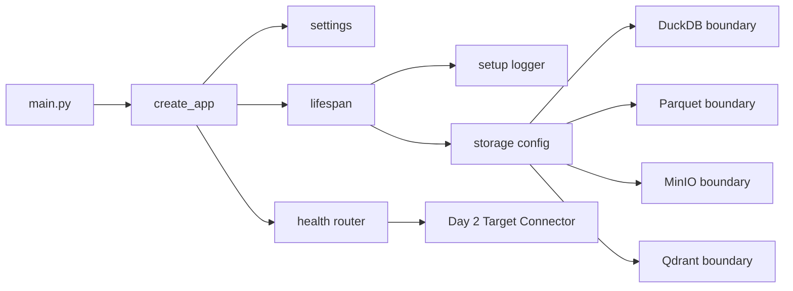
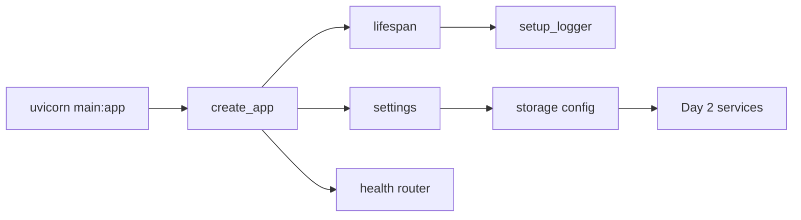

# Day 1：建立 Attacker 的异步工程底座

## 今天的总目标

- 把 `Attacker` 从一个 FastAPI Hello World 项目推进成一个有清晰工程边界的后端骨架
- 先把配置、日志、生命周期和存储边界立住，而不是一开始就写攻击逻辑
- 建立 `DuckDB + Parquet + MinIO + Qdrant` 的配置入口和读写封装方向
- 明确所有数据库读写和网络 IO 的异步原则，避免在 async 服务里混入阻塞调用
- 为 Day 2 的目标 Agent 接入、攻击样本解析和最小测试任务执行准备基础设施

## 今天结束前，你必须拿到什么

- 一条真正清楚的 `startup -> settings -> logger -> lifespan -> health -> storage boundary` 主链
- 一套 Day 1 最小配置 schema
- 一套 Day 1 最小日志初始化方案
- 一套 Day 1 最小 storage 封装边界
- 一份能讲清楚“为什么 async 服务里不能直接混同步 IO”的判断标准
- 一份可以直接交给 Day 2 继续接 Target Connector 和 Attack Executor 的项目骨架
- 一份当前仓库里 Day 1 应该新增哪些文件、哪些文件只做小改的落点说明

---

## Day 1 一图总览

一句话总结：

> Day 1 不是写攻击能力，而是先让 Attacker 具备不会被 IO 阻塞拖垮的工程底座。

主链路先压缩成这一条：

```text
main.py
-> create_app()
-> load settings
-> setup logger
-> enter lifespan
-> prepare storage config
-> expose /health
-> Day 2 Target Connector
```

今天最不能混淆的 5 件事：

- Day 1 负责工程底座，不负责攻击执行
- 配置系统和日志系统是所有后续模块的入口
- DuckDB、Parquet、MinIO、Qdrant 今天先定边界，不急着做完整业务读写
- async 不是多线程，任何同步阻塞 IO 都可能卡住事件循环
- Day 2 接目标 Agent 时，必须站在 Day 1 的异步 IO 约束上继续写

---

## 为什么这一天重要

很多人会误以为 Day 1 只是：

- 新建几个目录
- 改一下 `main.py`
- 加一个 `/health`
- 配一下 `.env`

这都不够准确。

Day 1 真正重要的地方在于：

> 从今天开始，Attacker 要先成为一个异步边界清晰、配置清晰、日志可追踪的服务，而不是一堆攻击脚本的集合。

如果没有这一步，后面的：

- 目标 Agent API 调用
- 模型 API 调用
- DuckDB 结果写入
- Parquet 证据归档
- MinIO 报告上传
- Qdrant 向量索引写入
- Replay 复测

都会很容易混成同步阻塞逻辑。

尤其要记住：

> `async` 不是多线程。`async` 是协作式并发。如果一个 async route 里直接执行同步阻塞 IO，一个请求阻塞后，其他请求也会跟着受影响。

所以 Day 1 不是“补几个基础文件的一天”，  
而是系统第一次建立异步工程纪律的一天。

---

## Day 1 整体架构



再压缩成仓库里真正的文件落点：

```text
main.py
-> conf/settings.py
-> conf/logging.py
-> conf/storage_conf.py
-> app/core/lifespan.py
-> app/api/health.py
-> app/storage/duckdb_store.py
-> app/storage/parquet_store.py
-> app/storage/minio_store.py
-> app/storage/qdrant_store.py
-> Day 2 再接 target connector 和 attack executor
```

---

## 今天的边界要讲透

Day 1 解决的是：

```text
FastAPI 应用怎样启动
配置怎样统一读取
日志怎样统一初始化
DuckDB / Parquet / MinIO / Qdrant 的边界放在哪里
同步 IO 怎样在 async 服务里被隔离
Day 2 的目标 Agent 接入应该依赖哪些基础设施
```

Day 1 不解决的是：

```text
攻击样本怎样设计完整分类
目标 Agent 怎样被真正攻击
Judge Engine 怎样判断复杂违规
报告怎样生成最终版本
Replay 怎样完整复测
前端控制台怎样展示
任务队列怎样接管执行链
```

### 今天之后，各层职责应该怎么理解

| 位置 | Day 1 负责什么 | Day 1 不负责什么 |
| --- | --- | --- |
| `main.py` | 创建 FastAPI app，注册 lifespan 和 health router | 写业务接口 |
| `conf/settings.py` | 统一读取 app、log、storage 配置 | 直接初始化外部连接 |
| `conf/logging.py` | 初始化统一 logger | 写业务日志内容 |
| `conf/storage_conf.py` | 暴露存储配置对象和路径 | 执行大量读写 |
| `app/core/lifespan.py` | 管理启动和关闭生命周期 | 执行攻击任务 |
| `app/api/health.py` | 提供最小健康检查 | 探测全部外部依赖 |
| `app/storage/duckdb_store.py` | 定义 DuckDB 异步隔离边界 | 在 route 中直接暴露 connection |
| `app/storage/parquet_store.py` | 定义证据归档边界 | Day 1 就实现完整 Parquet 数据集 |
| `app/storage/minio_store.py` | 定义对象存储边界 | Day 1 就强依赖真实 MinIO |
| `app/storage/qdrant_store.py` | 定义向量索引边界 | Day 1 就做完整相似检索 |

### 对当前仓库的处理原则

Day 1 对现有目录先做三类判断：

| 分类 | 目录 / 文件 | 处理方式 |
| --- | --- | --- |
| 直接复用 | `pyproject.toml` `uv.lock` | 保留当前 FastAPI 起点，按需补依赖 |
| 小改接入 | `main.py` | 从 Hello World 改成 `create_app()` 入口 |
| 新增文件 | `conf/` `app/` `steps/day1.md` `.env.example` | 作为 Day 1 主线落点 |

这个判断很重要。  
它能防止 Day 1 一上来就为了“平台完整”引入太多层，结果最基础的异步服务骨架反而没先跑稳。

---

## 今天开始，先不要急着写攻击逻辑

Day 1 最容易犯的错误就是：

- 一看到项目叫 `Attacker`，就马上写 prompt injection 样本
- 一看到 DuckDB，就直接在 route 里同步写 SQL
- 一看到 MinIO，就直接用同步 SDK 在请求里上传文件
- 一看到 Qdrant，就马上写完整向量检索
- 一看到 FastAPI，就把所有逻辑都堆进 `main.py`

这些都不是 Day 1 的重点。

今天真正要解决的是：

> Attacker 的配置、日志、生命周期和存储边界怎样先稳定下来。

如果这个问题没讲清楚，  
后面会出现两个典型坏结果：

- 攻击执行链能跑，但一遇到慢 IO 就把服务卡住
- 证据能写入，但日志、配置、存储路径和错误上下文全部散落

所以 Day 1 的关键词不是“攻击”，而是：

```text
配置
日志
生命周期
异步边界
存储封装
健康检查
```

---

## 第 1 层：Day 1 的本质是什么

Day 1 定的是：

```text
工程底座和异步纪律
```

Day 2 定的是：

```text
目标 Agent 接入和攻击样本读取
```

Day 3 定的是：

```text
证据归档和测试结果落库
```

Day 4 定的是：

```text
Qdrant 样本索引和相似攻击检索
```

Day 5 定的是：

```text
报告生成和最小 Replay
```

也就是说，Day 1 不是继续讨论产品定位，  
而是开始回答一个非常具体的问题：

```text
一个异步 Agent 红队后端
-> 怎样启动
-> 怎样读取配置
-> 怎样输出日志
-> 怎样隔离同步 IO
-> 怎样给后续攻击链留出稳定落点
```

这一步一旦走通，  
Attacker 后面的攻击执行层就不再是临时脚本，而是围绕稳定服务骨架演进。

---

## 第 2 层：Day 1 的主链一定要从应用启动出发

今天你要先把 Day 1 的主链牢牢记成这样：

```text
create_app
-> load settings
-> setup logger in lifespan
-> register health router
-> prepare storage boundaries
-> serve Day 2 modules
```

这里最重要的不是步骤名字，  
而是你要看清楚：

- Day 1 接的是当前 Hello World 项目
- 不是直接跳到攻击任务
- 不是直接连生产环境 MinIO / Qdrant
- 不是把 DuckDB connection 泄露给业务层
- 不是在 route 里写同步阻塞 IO

### 为什么一定要从应用启动出发

因为 FastAPI 项目后面所有功能都会挂在同一个 app 上：

```text
settings
logger
lifespan
router
storage
service
```

如果这个启动主链不稳，  
后续每一天都会出现重复问题：

- 配置在哪里读
- 日志怎么打
- 外部连接什么时候初始化
- 存储失败怎么追踪
- 同步 SDK 怎么隔离

Day 1 要先把这些问题定住。

---

## 第 3 层：为什么 Day 1 一定要同时保留配置层和 storage 层

很多人会本能地只做两种极端之一：

```text
只写 settings，不写 storage 边界
```

或者：

```text
直接写 storage 连接，不管配置层
```

这两种都不够。

### 问题 1：只有配置层，不够支撑后续业务

如果只有 `.env` 和 `settings`，  
Day 2、Day 3 依然可能把 DuckDB、MinIO、Qdrant SDK 直接散落到业务里。

### 问题 2：只有 storage 连接，不够支撑部署切换

如果直接在 storage 里硬编码路径和 endpoint，  
本地开发、PoC、私有化部署会很难切换。

### Day 1 最稳的做法

Day 1 一定要同时保留：

- `settings`
- `storage_conf`
- `storage store boundary`

因为这三个层级分别服务不同问题：

- `settings` 服务配置来源
- `storage_conf` 服务配置转译
- `storage store` 服务读写隔离

---

## 第 4 层：Day 1 先把异步结果契约讲清楚

今天最值得先定住的，不是具体用哪个 DuckDB 建表语句，  
而是后续所有 IO 操作到底应该遵守什么契约。

### 网络 IO 的最小契约

```text
目标 Agent API -> async client
模型 API -> async client
Qdrant -> async client
MinIO -> async wrapper or to_thread
```

### 数据库和文件 IO 的最小契约

```text
DuckDB -> storage 封装 + asyncio.to_thread
Parquet -> storage 封装 + asyncio.to_thread or background task
大文件写入 -> 不直接阻塞 route
```

### 为什么 Day 1 就要写清楚

因为等 Day 2 开始接目标 Agent 后，  
开发者很容易顺手写：

```python
requests.post(...)
duckdb.connect(...).execute(...)
```

这在同步脚本里可以接受，  
但在 FastAPI async 服务里会成为隐患。

Day 1 的规则是：

> route 里只编排，不直接做不可控同步 IO。

---

## 第 5 层：Day 1 最小工程步骤应该先有哪些

Day 1 最稳的做法，不是一次引入最复杂的基础设施。  
而是先把最小、最有价值、最不容易返工的步骤立住。

### 步骤 1：建立配置系统

至少要确保：

- 可以从 `.env` 读取配置
- 可以有本地默认值
- 业务代码不直接读 `os.environ`
- 配置覆盖 app、log、duckdb、parquet、minio、qdrant

### 步骤 2：建立日志系统

至少先输出：

- 控制台日志
- 文件日志
- 启动日志
- shutdown 日志

### 步骤 3：建立 lifespan

至少先做到：

- 服务启动时 setup logger
- 服务启动时记录环境
- 服务关闭时记录日志
- 暂时不强依赖外部服务可用

### 步骤 4：建立 health API

至少先返回：

- `status`
- `service`
- `environment`

### 步骤 5：建立 storage 边界

至少先定义：

- `DuckDBStore`
- `ParquetStore`
- `MinIOStore`
- `QdrantStore`

这一步非常重要。  
它让 Day 2 以后不会把底层 SDK 直接写进 router 或 service。

---

## 第 6 层：结合当前仓库，Day 1 最小落点应该放在哪

基于当前项目实际目录，  
Day 1 最稳的做法不是一下子引入完整平台架构，  
而是在已有 FastAPI 起点上补一条独立的工程主线：

```text
main.py
conf/settings.py
conf/logging.py
conf/storage_conf.py
app/core/lifespan.py
app/api/health.py
app/storage/*.py
.env.example
```

### `main.py`

负责：

- 创建 FastAPI 应用
- 注册 lifespan
- 注册 health router

### `conf/settings.py`

负责：

- 统一配置入口
- 读取 `.env`
- 给本地开发提供默认值

### `conf/logging.py`

负责：

- 初始化 loguru
- 管理控制台和文件日志

### `conf/storage_conf.py`

负责：

- 转译 storage 相关配置
- 提供路径和连接参数

### `app/core/lifespan.py`

负责：

- 启动和关闭生命周期
- 初始化日志
- 为后续 storage 初始化留位置

### `app/api/health.py`

负责：

- 暴露 `/health`
- 验证服务能启动

### `app/storage/`

负责：

- 定义所有存储读写边界
- 隔离同步阻塞调用
- 防止业务层直接依赖底层 SDK

---

## 第 7 层：Day 1 最小接口建议长什么样

今天最关键的接口只有一个：

- `GET /health`

### `GET /health`

它的职责是：

- 证明 FastAPI 服务启动成功
- 证明配置可以被读取
- 返回当前服务环境

它不负责：

- 检查 DuckDB 是否建表完成
- 检查 MinIO 是否在线
- 检查 Qdrant collection 是否存在
- 检查目标 Agent 是否可用

### 为什么 Day 1 的 health 要克制

因为 Day 1 的目标是本地服务稳定启动。  
如果一开始就让 `/health` 强依赖 MinIO、Qdrant、模型 API，开发体验会变差。

外部依赖的 readiness check 可以后面单独做：

```text
GET /health
GET /ready
GET /storage/status
```

---

## 第 8 层：Day 1 不建议做什么

### 不要今天就把攻击样本接进来

Day 2 会专门处理：

- 样本格式
- 样本加载器
- Target Connector
- 最小攻击执行链

Day 1 只负责底座。

### 不要在 route 里直接写 DuckDB

如果今天就写：

```python
con = duckdb.connect(...)
con.execute(...)
```

这个习惯后面很难改。

Day 1 就应该定住：

```text
route -> service -> storage -> SDK
```

### 不要把同步网络 SDK 直接放进 async 函数

如果必须使用同步 SDK，  
也要先经过 `asyncio.to_thread()` 或后续 worker 隔离。

### 不要今天就依赖所有外部服务真实启动

Day 1 的代码应该在没有 MinIO、没有 Qdrant 的情况下也能启动。  
真实连通性从 Day 3、Day 4 再逐步接入。

---

## 上午学习：09:00 - 12:00

## 09:00 - 09:50：把 Day 1 的主问题讲顺

### 今天你要能顺着说出来

```text
当前项目还是 Hello World
-> Day 1 先把 app 启动入口改清楚
-> 配置统一进入 settings
-> 日志统一进入 setup_logger
-> lifespan 管启动和关闭
-> storage 层只暴露异步边界
-> Day 2 再接目标 Agent 和攻击样本
```

### 你必须能回答这两个问题

1. 为什么 Day 1 不应该直接写攻击执行逻辑？
2. 为什么 async 服务里不能直接混入同步数据库和网络 IO？

---

## 09:50 - 10:40：先画 Day 1 的主链图

### Day 1 工程底座主链



### 这张图要表达什么

系统真正围绕的是：

- 应用启动
- 配置读取
- 日志初始化
- 存储边界

而不是“今天先写一个能攻击的脚本”这么局部的动作。

---

## 10:40 - 11:30：先整理 Day 1 的工程契约

### `steps/day1_engineering_contract.md` 练手骨架版

````markdown
# Day 1 工程契约

## 配置入口

- TODO

## 日志入口

- TODO

## 异步 IO 原则

- TODO

## Day 2 会消费什么

- TODO
````

### `steps/day1_engineering_contract.md` 参考答案

````markdown
# Day 1 工程契约

## 配置入口

- 所有配置通过 `conf/settings.py` 暴露
- 业务代码不直接读取 `os.environ`
- 本地默认值必须支持服务启动

## 日志入口

- 服务启动时在 lifespan 中调用 `setup_logger()`
- 业务代码统一使用 logger
- 禁止使用 print 作为业务日志

## 异步 IO 原则

- 网络 IO 默认使用 async client
- DuckDB 和 Parquet 这类同步 IO 必须通过 storage 封装隔离
- route 中不直接执行不可控同步阻塞调用

## Day 2 会消费什么

- `settings`
- `logger`
- `health router`
- `storage config`
- `app/storage/` 中的存储边界
````

### 这一段你一定要看懂

Day 1 真正要统一的不是“目录看起来漂亮”，  
而是后面所有模块写代码时遵守的工程契约。

---

## 11:30 - 12:00：先决定今天怎么验收

### Day 1 最直接的验收方式

今天至少要能回答：

1. FastAPI 应用入口在哪里？
2. 配置从哪里统一读取？
3. 日志在哪里初始化？
4. DuckDB 这类同步 API 为什么不能直接写在 async route 里？
5. Day 2 要从 Day 1 继承哪些基础设施？

---

## 下午编码：14:00 - 18:00

## 14:00 - 14:40：先补 `conf/settings.py`

建议先补：

- `AppSettings`
- `LogSettings`
- `DuckDBSettings`
- `ParquetSettings`
- `MinIOSettings`
- `QdrantSettings`
- `AgentSettings`
- `Settings`
- `get_settings`

### `conf/settings.py` 练手骨架版

```python
from functools import lru_cache

from pydantic_settings import BaseSettings


class AppSettings(BaseSettings):
    # 你要做的事：
    # 1. 定义 app_name
    # 2. 定义 app_env
    # 3. 定义 debug
    # 4. 定义 api_prefix
    raise NotImplementedError


class LogSettings(BaseSettings):
    # 你要做的事：
    # 1. 定义 log_level
    # 2. 定义 log_dir
    # 3. 定义 log_rotation
    # 4. 定义 log_retention
    raise NotImplementedError


class DuckDBSettings(BaseSettings):
    # 你要做的事：
    # 1. 定义 database_path
    # 2. 定义 read_only
    raise NotImplementedError


class ParquetSettings(BaseSettings):
    # 你要做的事：
    # 1. 定义 evidence_dir
    raise NotImplementedError


class MinIOSettings(BaseSettings):
    # 你要做的事：
    # 1. 定义 endpoint
    # 2. 定义 access_key
    # 3. 定义 secret_key
    # 4. 定义 bucket
    # 5. 定义 secure
    raise NotImplementedError


class QdrantSettings(BaseSettings):
    # 你要做的事：
    # 1. 定义 url
    # 2. 定义 api_key
    # 3. 定义 collection_attack_cases
    # 4. 定义 collection_findings
    raise NotImplementedError


class AgentSettings(BaseSettings):
    # 你要做的事：
    # 1. 定义 provider
    # 2. 定义 base_url
    # 3. 定义 api_key
    # 4. 定义 model
    # 5. 注意：这个 key 是 Attacker 自己的大脑 key，不是目标 Agent 的 key
    raise NotImplementedError


class Settings(BaseSettings):
    # 你要做的事：
    # 1. 设置 env_file
    # 2. 设置 env_nested_delimiter
    # 3. 聚合所有配置
    raise NotImplementedError


@lru_cache
def get_settings() -> Settings:
    # 你要做的事：
    # 1. 返回 Settings 单例
    raise NotImplementedError
```

### `conf/settings.py` 参考答案

```python
from functools import lru_cache

from pydantic import Field
from pydantic_settings import BaseSettings, SettingsConfigDict


class AppSettings(BaseSettings):
    app_name: str = "attacker"
    app_env: str = "local"
    debug: bool = True
    api_prefix: str = ""


class LogSettings(BaseSettings):
    log_level: str = "INFO"
    log_dir: str = "logs"
    log_rotation: str = "10 MB"
    log_retention: str = "14 days"


class DuckDBSettings(BaseSettings):
    database_path: str = "data/attacker.duckdb"
    read_only: bool = False


class ParquetSettings(BaseSettings):
    evidence_dir: str = "data/evidence"


class MinIOSettings(BaseSettings):
    endpoint: str = "localhost:9000"
    access_key: str = "minioadmin"
    secret_key: str = "minioadmin"
    bucket: str = "attacker"
    secure: bool = False


class QdrantSettings(BaseSettings):
    url: str = "http://localhost:6333"
    api_key: str | None = None
    collection_attack_cases: str = "attack_cases"
    collection_findings: str = "findings"


class AgentSettings(BaseSettings):
    provider: str = "qwen"
    base_url: str = "https://dashscope.aliyuncs.com/compatible-mode/v1"
    api_key: str | None = None
    model: str = "qwen3.6-plus"


class Settings(BaseSettings):
    model_config = SettingsConfigDict(
        env_file=".env",
        env_file_encoding="utf-8",
        env_nested_delimiter="__",
        extra="ignore",
    )

    app: AppSettings = Field(default_factory=AppSettings)
    log: LogSettings = Field(default_factory=LogSettings)
    duckdb: DuckDBSettings = Field(default_factory=DuckDBSettings)
    parquet: ParquetSettings = Field(default_factory=ParquetSettings)
    minio: MinIOSettings = Field(default_factory=MinIOSettings)
    qdrant: QdrantSettings = Field(default_factory=QdrantSettings)
    agent: AgentSettings = Field(default_factory=AgentSettings)


@lru_cache
def get_settings() -> Settings:
    return Settings()


settings = get_settings()
```

### 这里要先理解的点

Day 1 的 settings 不是为了“把配置写漂亮”，  
而是为了防止后面业务代码到处读环境变量。

---

## 14:40 - 15:20：先补 `conf/logging.py`

建议先补：

- `setup_logger`

### `conf/logging.py` 练手骨架版

```python
def setup_logger() -> None:
    # 你要做的事：
    # 1. 创建日志目录
    # 2. 移除 loguru 默认 handler
    # 3. 添加控制台日志
    # 4. 添加文件日志
    # 5. 日志级别从 settings 读取
    raise NotImplementedError
```

### `conf/logging.py` 参考答案

```python
from pathlib import Path
import sys

from loguru import logger

from conf.settings import settings


def setup_logger() -> None:
    log_dir = Path(settings.log.log_dir)
    log_dir.mkdir(parents=True, exist_ok=True)

    logger.remove()
    logger.add(
        sys.stderr,
        level=settings.log.log_level,
        enqueue=True,
        backtrace=True,
        diagnose=settings.app.debug,
    )
    logger.add(
        log_dir / "attacker.log",
        level=settings.log.log_level,
        rotation=settings.log.log_rotation,
        retention=settings.log.log_retention,
        encoding="utf-8",
        enqueue=True,
        backtrace=True,
        diagnose=settings.app.debug,
    )
```

### 为什么日志今天就要做

因为后续每一次攻击执行、目标调用、证据写入和报告生成都必须能追踪。  
如果今天继续用 `print`，后面补审计日志会很痛苦。

---

## 15:20 - 16:00：补 `conf/storage_conf.py` 和 `.env.example`

Day 1 不直接连接所有外部服务，  
但必须把存储配置入口先立住。

### `conf/storage_conf.py` 练手骨架版

```python
def get_duckdb_path():
    # 你要做的事：
    # 1. 从 settings 读取 DuckDB 文件路径
    # 2. 返回 Path 对象
    raise NotImplementedError


def get_parquet_evidence_dir():
    # 你要做的事：
    # 1. 从 settings 读取 evidence_dir
    # 2. 返回 Path 对象
    raise NotImplementedError


def get_minio_config():
    # 你要做的事：
    # 1. 返回 MinIO 所需连接参数
    # 2. 不要在这里创建真实连接
    raise NotImplementedError


def get_qdrant_config():
    # 你要做的事：
    # 1. 返回 Qdrant 所需连接参数
    # 2. 不要在这里创建真实连接
    raise NotImplementedError
```

### `conf/storage_conf.py` 参考答案

```python
from pathlib import Path

from conf.settings import settings


def get_duckdb_path() -> Path:
    return Path(settings.duckdb.database_path)


def get_parquet_evidence_dir() -> Path:
    return Path(settings.parquet.evidence_dir)


def get_minio_config() -> dict:
    return {
        "endpoint": settings.minio.endpoint,
        "access_key": settings.minio.access_key,
        "secret_key": settings.minio.secret_key,
        "secure": settings.minio.secure,
        "bucket": settings.minio.bucket,
    }


def get_qdrant_config() -> dict:
    return {
        "url": settings.qdrant.url,
        "api_key": settings.qdrant.api_key,
        "collection_attack_cases": settings.qdrant.collection_attack_cases,
        "collection_findings": settings.qdrant.collection_findings,
    }
```

### `.env.example` 参考答案

```dotenv
APP__APP_NAME=attacker
APP__APP_ENV=local
APP__DEBUG=true
APP__API_PREFIX=

LOG__LOG_LEVEL=INFO
LOG__LOG_DIR=logs
LOG__LOG_ROTATION=10 MB
LOG__LOG_RETENTION=14 days

AGENT__PROVIDER=qwen
AGENT__BASE_URL=https://dashscope.aliyuncs.com/compatible-mode/v1
AGENT__API_KEY=
AGENT__MODEL=qwen3.6-plus

DUCKDB__DATABASE_PATH=data/attacker.duckdb
DUCKDB__READ_ONLY=false

PARQUET__EVIDENCE_DIR=data/evidence

MINIO__ENDPOINT=localhost:9000
MINIO__ACCESS_KEY=minioadmin
MINIO__SECRET_KEY=minioadmin
MINIO__BUCKET=attacker
MINIO__SECURE=false

QDRANT__URL=http://localhost:6333
QDRANT__API_KEY=
QDRANT__COLLECTION_ATTACK_CASES=attack_cases
QDRANT__COLLECTION_FINDINGS=findings
```

### 这里要先理解的点

`storage_conf.py` 不是 storage service。  
它只负责把 settings 转成存储层能消费的配置，不负责做大量读写。

---

## 16:00 - 16:40：补 `app/core/lifespan.py` 和 `app/api/health.py`

这一步让服务从“能启动”变成“启动链路清楚”。

### `app/core/lifespan.py` 练手骨架版

```python
def create_lifespan():
    # 你要做的事：
    # 1. 返回 FastAPI lifespan
    # 2. 启动时调用 setup_logger
    # 3. 启动时记录服务名和环境
    # 4. 关闭时记录 shutdown 日志
    # 5. Day 1 不强依赖真实外部服务
    raise NotImplementedError
```

### `app/core/lifespan.py` 参考答案

```python
from contextlib import asynccontextmanager

from fastapi import FastAPI
from loguru import logger

from conf.logging import setup_logger
from conf.settings import settings


def create_lifespan():
    @asynccontextmanager
    async def lifespan(app: FastAPI):
        setup_logger()
        logger.info(
            "attacker service starting",
            service=settings.app.app_name,
            environment=settings.app.app_env,
        )
        yield
        logger.info("attacker service shutdown")

    return lifespan
```

### `app/api/health.py` 练手骨架版

```python
async def health_check():
    # 你要做的事：
    # 1. 返回 status
    # 2. 返回 service
    # 3. 返回 environment
    # 4. 不要在 Day 1 探测外部服务
    raise NotImplementedError
```

### `app/api/health.py` 参考答案

```python
from fastapi import APIRouter

from conf.settings import settings

router = APIRouter(tags=["health"])


@router.get("/health")
async def health_check() -> dict:
    return {
        "status": "ok",
        "service": settings.app.app_name,
        "environment": settings.app.app_env,
    }
```

### 为什么 health 今天要保持简单

Day 1 的目标是验证服务本身。  
MinIO、Qdrant、目标 Agent 的连通性后面可以放到 readiness 或 storage status 接口，不要让 Day 1 被外部依赖拖住。

---

## 16:40 - 17:30：补 `app/storage/` 的四个边界文件

今天只立住 storage 边界，不把完整业务读写做重。

### `app/storage/duckdb_store.py` 练手骨架版

```python
class DuckDBStore:
    def __init__(self, database_path=None):
        # 你要做的事：
        # 1. 保存 DuckDB 文件路径
        raise NotImplementedError

    async def initialize(self):
        # 你要做的事：
        # 1. 通过 asyncio.to_thread 隔离同步初始化
        raise NotImplementedError

    async def execute(self, sql: str, parameters=None):
        # 你要做的事：
        # 1. 异步执行写入或 DDL
        # 2. 不要让业务层直接拿 connection
        raise NotImplementedError

    async def fetch_all(self, sql: str, parameters=None):
        # 你要做的事：
        # 1. 异步执行查询
        # 2. 返回多行结果
        raise NotImplementedError
```

### `app/storage/duckdb_store.py` 参考答案

```python
import asyncio
from pathlib import Path
from typing import Any

import duckdb

from conf.storage_conf import get_duckdb_path


class DuckDBStore:
    def __init__(self, database_path: Path | None = None) -> None:
        self.database_path = database_path or get_duckdb_path()

    async def initialize(self) -> None:
        await asyncio.to_thread(self._initialize_sync)

    def _initialize_sync(self) -> None:
        self.database_path.parent.mkdir(parents=True, exist_ok=True)
        with duckdb.connect(str(self.database_path)) as con:
            con.execute("select 1")

    async def execute(self, sql: str, parameters: list[Any] | None = None) -> None:
        await asyncio.to_thread(self._execute_sync, sql, parameters or [])

    def _execute_sync(self, sql: str, parameters: list[Any]) -> None:
        with duckdb.connect(str(self.database_path)) as con:
            con.execute(sql, parameters)

    async def fetch_all(self, sql: str, parameters: list[Any] | None = None) -> list[tuple]:
        return await asyncio.to_thread(self._fetch_all_sync, sql, parameters or [])

    def _fetch_all_sync(self, sql: str, parameters: list[Any]) -> list[tuple]:
        with duckdb.connect(str(self.database_path)) as con:
            return con.execute(sql, parameters).fetchall()
```

### `app/storage/parquet_store.py` 练手骨架版

```python
class ParquetStore:
    def __init__(self, evidence_dir=None):
        # 你要做的事：
        # 1. 保存证据目录
        raise NotImplementedError

    async def ensure_dirs(self):
        # 你要做的事：
        # 1. 异步创建证据目录
        raise NotImplementedError

    async def write_events(self, dataset: str, rows: list[dict]):
        # 你要做的事：
        # 1. 异步写入事件数据
        # 2. Day 1 可以先只保留边界
        raise NotImplementedError
```

### `app/storage/parquet_store.py` 参考答案

```python
import asyncio
from pathlib import Path

from conf.storage_conf import get_parquet_evidence_dir


class ParquetStore:
    def __init__(self, evidence_dir: Path | None = None) -> None:
        self.evidence_dir = evidence_dir or get_parquet_evidence_dir()

    async def ensure_dirs(self) -> None:
        await asyncio.to_thread(self._ensure_dirs_sync)

    def _ensure_dirs_sync(self) -> None:
        self.evidence_dir.mkdir(parents=True, exist_ok=True)

    async def write_events(self, dataset: str, rows: list[dict]) -> Path:
        return await asyncio.to_thread(self._write_events_sync, dataset, rows)

    def _write_events_sync(self, dataset: str, rows: list[dict]) -> Path:
        # Day 1 只保留边界。Day 3 再接入 pyarrow 写 Parquet。
        dataset_dir = self.evidence_dir / dataset
        dataset_dir.mkdir(parents=True, exist_ok=True)
        return dataset_dir
```

### `app/storage/minio_store.py` 练手骨架版

```python
class MinIOStore:
    def __init__(self, config=None):
        # 你要做的事：
        # 1. 保存 MinIO 配置
        # 2. Day 1 不强制创建真实 client
        raise NotImplementedError

    async def upload_file(self, object_name: str, file_path: str):
        # 你要做的事：
        # 1. 异步上传文件
        # 2. 如果 SDK 同步，就用线程池隔离
        raise NotImplementedError
```

### `app/storage/minio_store.py` 参考答案

```python
import asyncio

from conf.storage_conf import get_minio_config


class MinIOStore:
    def __init__(self, config: dict | None = None) -> None:
        self.config = config or get_minio_config()

    async def upload_file(self, object_name: str, file_path: str) -> str:
        return await asyncio.to_thread(self._upload_file_sync, object_name, file_path)

    def _upload_file_sync(self, object_name: str, file_path: str) -> str:
        # Day 1 只定义边界。Day 3 再接入 minio SDK。
        return object_name
```

### `app/storage/qdrant_store.py` 练手骨架版

```python
class QdrantStore:
    def __init__(self, config=None):
        # 你要做的事：
        # 1. 保存 Qdrant 配置
        # 2. Day 1 不强制创建真实 client
        raise NotImplementedError

    async def upsert_attack_case(self, case_id: str, vector: list[float], payload: dict):
        # 你要做的事：
        # 1. 异步写入攻击样本向量
        raise NotImplementedError

    async def search_similar_cases(self, vector: list[float], limit: int = 5):
        # 你要做的事：
        # 1. 异步搜索相似攻击样本
        raise NotImplementedError
```

### `app/storage/qdrant_store.py` 参考答案

```python
from conf.storage_conf import get_qdrant_config


class QdrantStore:
    def __init__(self, config: dict | None = None) -> None:
        self.config = config or get_qdrant_config()

    async def upsert_attack_case(
        self,
        case_id: str,
        vector: list[float],
        payload: dict,
    ) -> None:
        # Day 1 只定义边界。Day 4 再接入 qdrant async client。
        return None

    async def search_similar_cases(
        self,
        vector: list[float],
        limit: int = 5,
    ) -> list[dict]:
        # Day 1 只定义边界。Day 4 再接入 qdrant async client。
        return []
```

### 这里要先理解的点

1. DuckDB Python API 偏同步，所以必须通过 `asyncio.to_thread()` 隔离  
2. Parquet 写入涉及文件 IO 和编码计算，不能直接阻塞 route  
3. MinIO 是网络 IO，如果 SDK 同步就必须隔离  
4. Qdrant 后续优先使用 async client  
5. 业务层不能直接操作底层 SDK  

---

## 17:30 - 18:00：改造 `main.py` 并补依赖说明

### `main.py` 练手骨架版

```python
def create_app():
    # 你要做的事：
    # 1. 创建 FastAPI 应用
    # 2. 注册 lifespan
    # 3. 注册 health router
    # 4. 不保留 Hello World 示例接口
    raise NotImplementedError


app = create_app()
```

### `main.py` 参考答案

```python
from fastapi import FastAPI

from app.api.health import router as health_router
from app.core.lifespan import create_lifespan
from conf.settings import settings


def create_app() -> FastAPI:
    app = FastAPI(
        title=settings.app.app_name,
        debug=settings.app.debug,
        lifespan=create_lifespan(),
    )
    app.include_router(health_router, prefix=settings.app.api_prefix)
    return app


app = create_app()
```

### `pyproject.toml` 建议补充

如果按今天参考答案落代码，需要补：

```toml
dependencies = [
    "duckdb>=1.4.0",
    "fastapi>=0.136.1",
    "loguru>=0.7.3",
    "pydantic-settings>=2.12.0",
    "uvicorn>=0.46.0",
]
```

### 为什么 Day 1 先不加全部依赖

`pyarrow`、`minio`、`qdrant-client` 可以等 Day 3 和 Day 4 真正接入时再加入。  
Day 1 只需要保证服务骨架能稳定跑起来。

---

## 晚上复盘：20:00 - 21:00

### 今晚你必须自己讲顺的 8 个点

1. Day 1 的本质为什么是“异步工程底座”，不是“攻击逻辑开发”？  
2. 为什么配置必须统一进入 `conf/settings.py`？  
3. 为什么日志必须在 lifespan 里初始化？  
4. 为什么 Day 1 的 `/health` 不应该强依赖 MinIO、Qdrant 或目标 Agent？  
5. 为什么 DuckDB 读写不能直接出现在 async route 里？  
6. 为什么 Parquet、MinIO、Qdrant 都需要 storage 封装边界？  
7. 为什么 Day 2 接 Target Connector 时必须使用 async HTTP client？  
8. 今天的骨架怎样支撑后续攻击执行、证据归档、报告生成和 Replay？  

---

## 今日验收标准

- `steps/day1.md` 对 Day 1 的目标、边界和文件落点讲清楚
- Day 1 的启动主链讲清楚
- 配置、日志、lifespan、health、storage 的最小结构讲清楚
- 每个建议新增文件都有练手骨架版和参考答案
- 异步 IO 原则讲清楚
- DuckDB 同步 API 的隔离方式讲清楚
- `main.py` 应该怎样从 Hello World 改成正式 app 入口讲清楚
- Day 2 的 Target Connector 和 Attack Executor 输入已经准备好

---

## 今天最容易踩的坑

### 坑 1：把 Day 1 当成随手建目录

问题：

- 目录建了，但配置、日志和 storage 边界没立住
- 后面业务代码还是乱读环境变量、乱调 SDK

规避建议：

- Day 1 必须先定住 `settings -> logging -> lifespan -> storage` 主链

### 坑 2：在 async route 里直接执行同步 DuckDB

问题：

- DuckDB 操作阻塞事件循环
- 一个慢请求可能影响其他请求

规避建议：

- 所有 DuckDB 操作经过 `DuckDBStore`
- 同步调用用 `asyncio.to_thread()` 隔离

### 坑 3：把 MinIO 和 Qdrant 做成 Day 1 强依赖

问题：

- 本地没有启动外部服务时，后端直接起不来
- 开发体验变差

规避建议：

- Day 1 只定义配置和边界
- Day 3、Day 4 再接真实服务

### 坑 4：继续保留 Hello World 接口

问题：

- 项目入口仍然像脚手架
- 后续路由结构不清晰

规避建议：

- `main.py` 使用 `create_app()`
- 只保留 `/health`

### 坑 5：日志继续使用 print

问题：

- 后续攻击任务、证据写入和报告生成无法追踪
- 无法形成审计基础

规避建议：

- Day 1 统一使用 loguru
- 业务代码不使用 print

### 坑 6：今天就把攻击逻辑提前混进来

问题：

- 主线失焦
- 工程底座还没稳，业务逻辑已经开始堆叠

规避建议：

- Day 1 只做工程底座
- Day 2 再进入 Target Connector 和攻击样本

---

## 给明天的交接提示

明天开始，Attacker 就不只是“一个能启动的 FastAPI 服务”，  
而是要开始真正接入被测目标：

```text
target agent api
-> attack sample
-> async connector
-> first test run
```

也就是说，后面会继续走向：

```text
settings
-> logger
-> storage boundary
-> target connector
-> attack executor
-> judge result
```

所以 Day 1 最关键的交接只有一句话：

```text
先把配置、日志、生命周期和异步存储边界立住，Day 2 的目标 Agent 接入才不会变成一堆阻塞脚本。
```
