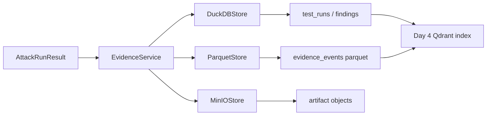
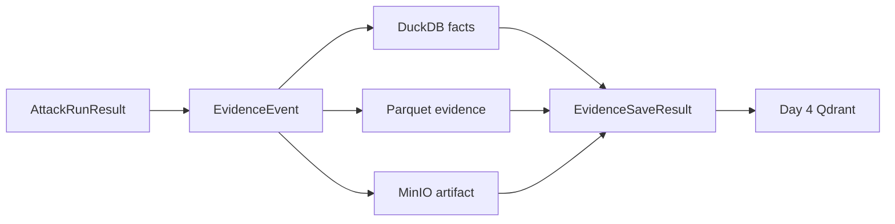

# Day 3：把攻击结果变成可追踪证据

## 今天的总目标

- 承接 Day 2 的 `AttackRunResult`，把一次 dry-run 攻击结果变成可追踪、可查询、可归档的证据
- 建立 DuckDB 结构化结果表，让目标、样本、执行结果和风险发现可以查询
- 建立 Parquet 证据归档，让请求、响应、Judge 结果和执行事件可以长期保存
- 建立 MinIO 文件存储边界，让报告、原始证据和大体积附件后续可以统一保存
- 保持 Day 1 定下的异步原则：所有 DuckDB、Parquet、MinIO 操作都不能直接阻塞 async route

## 今天结束前，你必须拿到什么

- 一条真正清楚的 `AttackRunResult -> DuckDB facts -> Parquet evidence -> MinIO artifact index` 主链
- 一套 Day 3 最小 DuckDB schema
- 一套 Day 3 最小 Parquet evidence event 契约
- 一个 Evidence Service，用来编排结构化落库和证据归档
- 一个异步 DuckDB 初始化和写入实现
- 一个 Parquet 事件写入实现
- 一个 MinIO artifact 存储接口边界
- 一个 `POST /tests/dry-run-and-save` 或类似接口，用于验证 Day 2 结果可以进入证据层
- 一份可以直接交给 Day 4 做 Qdrant 语义索引的证据摘要契约

---

## Day 3 一图总览

一句话总结：

> Day 3 不是继续增强攻击能力，而是让每一次攻击都留下可复盘的证据。

主链路先压缩成这一条：

```text
AttackRunResult
-> normalize evidence event
-> write structured facts to DuckDB
-> write raw evidence to Parquet
-> optionally store artifact to MinIO
-> return saved evidence id
-> Day 4 Qdrant semantic index
```

今天最不能混淆的 5 件事：

- Day 2 负责攻击执行，Day 3 负责证据落地
- DuckDB 保存结构化事实，不保存所有大体积原始内容
- Parquet 保存长期可分析的证据事件
- MinIO 保存报告、附件和大体积原始文件
- Evidence Service 负责编排存储，但不重新执行攻击逻辑

---

## 为什么这一天重要

很多人会误以为 Day 3 只是：

- 把结果 insert 到数据库
- 把 response 保存一下
- 把文件上传一下
- 后面报告需要时再整理

这都不够准确。

Day 3 真正重要的地方在于：

> 从今天开始，Attacker 的每一次攻击不再是临时输出，而是可以查询、复盘、报告、复测和训练样本库的证据资产。

如果没有这一步，后面的：

- 风险报告
- Replay 复测
- 修复前后对比
- Qdrant 相似案例检索
- 攻击样本优化
- 企业审计日志

都会没有稳定的数据基础。

所以 Day 3 不是“保存一下结果的一天”，  
而是系统第一次建立证据事实层的一天。

---

## Day 3 整体架构



再压缩成仓库里真正的文件落点：

```text
app/schemas/evidence_schema.py
app/storage/duckdb_store.py
app/storage/parquet_store.py
app/storage/minio_store.py
app/services/evidence_service.py
app/api/tests.py
data/attacker.duckdb
data/evidence/
```

---

## 今天的边界要讲透

Day 3 解决的是：

```text
怎样把 AttackRunResult 转成证据事件
怎样初始化 DuckDB 最小表结构
怎样把结构化结果写入 DuckDB
怎样把完整证据写成 Parquet 归档
怎样给 MinIO artifact 留出保存入口
怎样返回可追踪的 evidence_id
```

Day 3 不解决的是：

```text
怎样生成正式 Markdown/HTML 报告
怎样做 Qdrant 向量索引
怎样做相似攻击样本检索
怎样做完整 Replay
怎样做批量任务队列
怎样做前端证据详情页
```

### 今天之后，各层职责应该怎么理解

| 位置 | Day 3 负责什么 | Day 3 不负责什么 |
| --- | --- | --- |
| `app/schemas/evidence_schema.py` | 定义证据事件和保存结果 | 负责存储实现 |
| `app/storage/duckdb_store.py` | 初始化表和写结构化事实 | 判断攻击是否违规 |
| `app/storage/parquet_store.py` | 写证据事件归档 | 生成业务报告 |
| `app/storage/minio_store.py` | 保存 artifact 边界 | 强依赖真实 MinIO 必须在线 |
| `app/services/evidence_service.py` | 编排多存储写入 | 重新调用目标 Agent |
| `app/api/tests.py` | 增加 dry-run-and-save 验证入口 | 承担存储细节 |

### 对当前仓库的处理原则

Day 3 对现有目录先做三类判断：

| 分类 | 目录 / 文件 | 处理方式 |
| --- | --- | --- |
| 直接复用 | `AttackRunResult` `DuckDBStore` `ParquetStore` `MinIOStore` | 继续沿用 Day 1/Day 2 边界 |
| 小改接入 | `app/api/tests.py` `app/storage/*.py` | 增加保存和初始化能力 |
| 新增文件 | `app/schemas/evidence_schema.py` `app/services/evidence_service.py` | 作为 Day 3 主线落点 |

这个判断很重要。  
它能防止 Day 3 把证据归档、对象存储、数据库 schema 和 API 编排全部塞进 router。

---

## 今天开始，先不要急着生成正式报告

Day 3 最容易犯的错误就是：

- 一保存结果就顺手生成完整报告
- 一有证据就顺手写 Qdrant 向量索引
- 一有 DuckDB 就把所有原始大文本都塞进结构化表
- 一有 MinIO 就强依赖本地必须启动对象存储
- 一有接口就把存储细节都写进 route

这些都不是 Day 3 的重点。

今天真正要解决的是：

> Day 2 的一次攻击结果，怎样变成后续所有报告、复测和索引都能消费的证据事实。

如果这个问题没讲清楚，  
后面会出现两个典型坏结果：

- 报告能生成，但没有可追溯证据
- 证据能保存，但结构混乱，无法复测和统计

所以 Day 3 的关键词是：

```text
evidence_id
structured facts
parquet event
artifact
traceability
async storage
```

---

## 第 1 层：Day 3 的本质是什么

Day 1 定的是：

```text
工程底座和异步纪律
```

Day 2 定的是：

```text
目标 Agent 接入和第一条攻击执行链
```

Day 3 定的是：

```text
证据事实层
```

Day 4 定的是：

```text
攻击样本语义索引和相似案例检索
```

Day 5 定的是：

```text
报告生成和 Replay 复测
```

也就是说，Day 3 不是继续写攻击样本，  
而是开始回答另一个非常具体的问题：

```text
同样是一次攻击结果
-> 哪些结构化字段进入 DuckDB
-> 哪些完整证据进入 Parquet
-> 哪些大文件进入 MinIO
-> 怎样返回一个稳定 evidence_id
-> 怎样给 Day 4 做语义索引
```

这一步一旦走通，  
Attacker 就开始拥有“证据资产”，而不只是“攻击输出”。

---

## 第 2 层：Day 3 的主链一定要从 AttackRunResult 出发

今天你要先把 Day 3 的主链牢牢记成这样：

```text
AttackRunResult
-> EvidenceEvent
-> DuckDB structured facts
-> Parquet raw evidence
-> EvidenceSaveResult
```

这里最重要的不是步骤名字，  
而是你要看清楚：

- Day 3 接的是 Day 2 的结构化结果
- 不是重新调用目标 Agent
- 不是重新 Judge
- 不是重新生成攻击样本
- 不是绕开 Evidence Service 直接写存储

### 为什么一定要从 AttackRunResult 出发

因为 Day 2 已经建立了这条边界：

```text
target + sample
-> executor
-> AttackRunResult
```

那么 Day 3 最稳的接法就应该是：

```text
AttackRunResult
-> evidence
-> storage
```

而不是：

```text
重新拿 target 和 sample
-> 再执行一次攻击
-> 顺手保存结果
```

后者会把 Day 2 和 Day 3 的边界重新打乱。

---

## 第 3 层：为什么 Day 3 一定要同时保留结构化事实和原始证据

很多人会本能地只做两种极端之一：

```text
只写数据库表
```

或者：

```text
只保存原始 JSON 文件
```

这两种都不够。

### 问题 1：只有数据库表，不够支撑审计和复盘

如果只保留：

- sample_id
- violated
- risk_level
- reason

那后面很难还原：

- 当时具体请求是什么
- 目标 Agent 完整响应是什么
- Judge 当时基于什么文本判断
- 后续修复后怎样对比

### 问题 2：只有原始 JSON，不够支撑查询和统计

如果只把完整 JSON 放进文件，  
那后面要查这些问题会很痛苦：

- 哪个目标高危最多
- 哪类攻击命中最多
- 哪次测试失败了
- 哪些风险还没修复

### Day 3 最稳的做法

Day 3 一定要同时保留：

- `DuckDB structured facts`
- `Parquet raw evidence events`

因为这两个层级分别服务不同问题：

- DuckDB 服务“查询、统计、报告索引”
- Parquet 服务“完整证据、长期归档、复盘分析”

---

## 第 4 层：Day 3 先把证据事件契约讲清楚

今天最值得先定住的，不是 DuckDB 表名到底多优雅，  
而是 Day 3 产出的证据事件到底长什么样。

### Evidence Event 至少应该有这些

```text
evidence_id
run_id
target_name
sample_id
event_type
request_body
response_text
response_body
judge_result
latency_ms
created_at
```

### DuckDB 结构化事实至少应该有这些

```text
runs
findings
artifacts
```

### 为什么值得今天先保留 `run_id`

因为后续批量测试时，一次测试任务会包含多条攻击样本。  
`run_id` 是把这些样本归到同一次测试里的最小集合标识。

### 为什么值得今天先保留 `evidence_id`

因为报告、Replay、Qdrant 索引和人工复核都需要一个稳定证据引用。

---

## 第 5 层：Day 3 最小证据保存步骤应该先有哪些

Day 3 最稳的做法，不是一次引入完整数据平台。  
而是先把最小、最有价值、最可追踪的步骤立住。

### 步骤 1：定义 Evidence schema

至少要确保：

- `EvidenceEvent`
- `EvidenceSaveResult`
- `ArtifactRef`

### 步骤 2：初始化 DuckDB 表

至少先建：

- `test_runs`
- `findings`
- `artifacts`

### 步骤 3：写结构化结果

至少先写：

- run id
- target name
- sample id
- violated
- risk level
- latency
- error

### 步骤 4：写 Parquet 证据事件

至少先写：

- request body
- response text
- judge result
- created_at

### 步骤 5：返回保存结果

至少先返回：

- evidence_id
- run_id
- duckdb_saved
- parquet_path
- artifact_refs

---

## 第 6 层：结合当前仓库，Day 3 最小落点应该放在哪

基于当前项目实际目录，  
Day 3 最稳的做法是在 Day 2 的攻击执行链后补一层证据服务：

```text
app/schemas/evidence_schema.py
app/services/evidence_service.py
app/storage/duckdb_store.py
app/storage/parquet_store.py
app/storage/minio_store.py
app/api/tests.py
```

### `app/schemas/evidence_schema.py`

负责：

- 定义证据事件
- 定义 artifact 引用
- 定义保存结果

### `app/services/evidence_service.py`

负责：

- 从 AttackRunResult 构建 EvidenceEvent
- 调用 DuckDBStore
- 调用 ParquetStore
- 调用 MinIOStore
- 返回 EvidenceSaveResult

### `app/storage/duckdb_store.py`

负责：

- 初始化 Day 3 最小表
- 写入 test_runs
- 写入 findings
- 写入 artifacts 索引

### `app/storage/parquet_store.py`

负责：

- 写 evidence events
- 返回 Parquet 路径

### `app/storage/minio_store.py`

负责：

- 为 artifact 上传留出接口
- Day 3 可以先允许 no-op 或本地模拟

### `app/api/tests.py`

负责：

- 新增 dry-run-and-save 接口
- 不直接写存储细节

---

## 第 7 层：Day 3 最小接口建议长什么样

今天最关键的接口建议先有一个：

- `POST /tests/dry-run-and-save`

### `POST /tests/dry-run-and-save`

它的职责是：

- 接收目标 Agent 配置
- 接收攻击样本
- 复用 Day 2 Attack Executor
- 获取 AttackRunResult
- 调用 Evidence Service 保存证据
- 返回攻击结果和保存结果

它不负责：

- 生成正式报告
- 写 Qdrant
- 批量执行测试
- 执行 Replay

### 为什么 dry-run-and-save 很重要

它是 Day 2 到 Day 3 的验收口。

Day 2 证明：

```text
攻击能执行
```

Day 3 证明：

```text
攻击结果能沉淀成证据
```

---

## 第 8 层：Day 3 不建议做什么

### 不要今天就生成完整报告

报告需要汇总、模板、风险说明和修复建议。  
Day 3 先保存证据，Day 5 再生成报告。

### 不要今天就做 Qdrant

Qdrant 需要向量化和相似检索设计。  
Day 4 专门处理。

### 不要今天就做复杂数据库迁移系统

Day 3 只需要最小 schema 初始化。  
等表结构稳定后再考虑迁移工具。

### 不要今天就强依赖真实 MinIO

Day 3 可以先保留 MinIOStore 的接口和 artifact 索引。  
真实上传失败不能影响本地证据主链验证。

---

## 上午学习：09:00 - 12:00

## 09:00 - 09:50：把 Day 3 的主问题讲顺

### 今天你要能顺着说出来

```text
Day 2 已经能输出 AttackRunResult
-> Day 3 不重新攻击目标 Agent
-> Day 3 把 AttackRunResult 转成 EvidenceEvent
-> DuckDB 保存结构化事实
-> Parquet 保存完整证据事件
-> MinIO 保存大体积 artifact
-> Day 4 再把证据摘要写入 Qdrant
```

### 你必须能回答这两个问题

1. 为什么 Day 3 必须从 `AttackRunResult` 出发，而不是重新调用目标 Agent？
2. 为什么结构化事实和原始证据必须同时保留？

---

## 09:50 - 10:40：先画 Day 3 的主链图

### Day 3 证据保存主链



### 这张图要表达什么

系统真正围绕的是：

- 攻击执行结果
- 证据事件
- 结构化事实
- 原始证据归档
- 保存结果

而不是“把 response 随便存一下”。

---

## 10:40 - 11:30：先整理 Day 3 的证据契约

### `steps/day3_evidence_contract.md` 练手骨架版

````markdown
# Day 3 证据契约

## EvidenceEvent 最小结构

- TODO

## DuckDB 最小事实表

- TODO

## Parquet 最小事件数据

- TODO

## Day 4 会消费什么

- TODO
````

### `steps/day3_evidence_contract.md` 参考答案

````markdown
# Day 3 证据契约

## EvidenceEvent 最小结构

- `evidence_id`
- `run_id`
- `target_name`
- `sample_id`
- `event_type`
- `request_body`
- `response_text`
- `judge_result`
- `latency_ms`
- `created_at`

## DuckDB 最小事实表

- `test_runs`
- `findings`
- `artifacts`

## Parquet 最小事件数据

- 完整 request body
- 完整 response text
- response body 摘要
- judge result
- latency
- error
- created_at

## Day 4 会消费什么

- `evidence_id`
- `target_name`
- `sample_id`
- `risk_level`
- `judge reason`
- `response summary`
- `expected_violation`
````

### 这一段你一定要看懂

Day 3 真正要统一的不是“写到哪个文件”，  
而是报告、复测、语义索引和审计都能引用同一份证据。

---

## 11:30 - 12:00：先决定今天怎么验收

### Day 3 最直接的验收方式

今天至少要能回答：

1. Day 3 的输入到底是什么？
2. Day 3 的输出到底是什么？
3. 哪些字段进 DuckDB？
4. 哪些内容进 Parquet？
5. Day 4 为什么可以直接接 Day 3 的 evidence summary？

---

## 下午编码：14:00 - 18:00

## 14:00 - 14:35：先补 `app/schemas/evidence_schema.py`

建议先补：

- `ArtifactRef`
- `EvidenceEvent`
- `EvidenceSaveResult`

### `app/schemas/evidence_schema.py` 练手骨架版

```python
from pydantic import BaseModel


class ArtifactRef(BaseModel):
    # 你要做的事：
    # 1. 定义 object_key
    # 2. 定义 artifact_type
    # 3. 定义 storage_backend
    raise NotImplementedError


class EvidenceEvent(BaseModel):
    # 你要做的事：
    # 1. 定义 evidence_id
    # 2. 定义 run_id
    # 3. 定义 target_name
    # 4. 定义 sample_id
    # 5. 定义 request_body
    # 6. 定义 response_text
    # 7. 定义 judge_result
    # 8. 定义 latency_ms
    # 9. 定义 created_at
    raise NotImplementedError


class EvidenceSaveResult(BaseModel):
    # 你要做的事：
    # 1. 定义 evidence_id
    # 2. 定义 run_id
    # 3. 定义 duckdb_saved
    # 4. 定义 parquet_path
    # 5. 定义 artifact_refs
    raise NotImplementedError
```

### `app/schemas/evidence_schema.py` 参考答案

```python
from datetime import datetime, timezone
from typing import Any

from pydantic import BaseModel, Field


class ArtifactRef(BaseModel):
    object_key: str
    artifact_type: str
    storage_backend: str = "minio"


class EvidenceEvent(BaseModel):
    evidence_id: str
    run_id: str
    target_name: str
    sample_id: str
    event_type: str = "attack_run"
    request_body: dict[str, Any]
    response_text: str
    response_body: dict[str, Any] | list[Any] | None = None
    judge_result: dict[str, Any]
    latency_ms: int
    error: str | None = None
    created_at: datetime = Field(default_factory=lambda: datetime.now(timezone.utc))


class EvidenceSaveResult(BaseModel):
    evidence_id: str
    run_id: str
    duckdb_saved: bool
    parquet_path: str | None = None
    artifact_refs: list[ArtifactRef] = Field(default_factory=list)
```

### 这里要先理解的点

Evidence schema 不是为了替代 Day 2 的 AttackRunResult，  
而是为了把 AttackRunResult 转成可长期保存和引用的证据形态。

---

## 14:35 - 15:25：增强 `app/storage/duckdb_store.py`

建议新增：

- `initialize_schema`
- `save_test_run`
- `save_finding`
- `save_artifact_ref`

### `app/storage/duckdb_store.py` 练手骨架版

```python
class DuckDBStore:
    async def initialize_schema(self):
        # 你要做的事：
        # 1. 异步初始化 test_runs / findings / artifacts
        raise NotImplementedError

    async def save_test_run(self, event):
        # 你要做的事：
        # 1. 写入一次攻击执行事实
        raise NotImplementedError

    async def save_finding(self, event):
        # 你要做的事：
        # 1. 如果 judge_result.violated 为 true，写入 finding
        raise NotImplementedError

    async def save_artifact_ref(self, evidence_id: str, artifact):
        # 你要做的事：
        # 1. 写入 artifact 索引
        raise NotImplementedError
```

### `app/storage/duckdb_store.py` 参考答案

```python
import asyncio
import json
from pathlib import Path
from typing import Any

import duckdb

from app.schemas.evidence_schema import ArtifactRef, EvidenceEvent
from conf.storage_conf import get_duckdb_path


class DuckDBStore:
    def __init__(self, database_path: Path | None = None) -> None:
        self.database_path = database_path or get_duckdb_path()

    async def initialize(self) -> None:
        await asyncio.to_thread(self._initialize_sync)

    def _initialize_sync(self) -> None:
        self.database_path.parent.mkdir(parents=True, exist_ok=True)
        with duckdb.connect(str(self.database_path)) as con:
            con.execute("select 1")

    async def initialize_schema(self) -> None:
        await asyncio.to_thread(self._initialize_schema_sync)

    def _initialize_schema_sync(self) -> None:
        self.database_path.parent.mkdir(parents=True, exist_ok=True)
        with duckdb.connect(str(self.database_path)) as con:
            con.execute(
                """
                create table if not exists test_runs (
                    evidence_id varchar primary key,
                    run_id varchar,
                    target_name varchar,
                    sample_id varchar,
                    violated boolean,
                    risk_level varchar,
                    latency_ms integer,
                    error varchar,
                    created_at timestamp
                )
                """
            )
            con.execute(
                """
                create table if not exists findings (
                    evidence_id varchar,
                    run_id varchar,
                    target_name varchar,
                    sample_id varchar,
                    risk_level varchar,
                    reason varchar,
                    matched_patterns_json varchar,
                    created_at timestamp
                )
                """
            )
            con.execute(
                """
                create table if not exists artifacts (
                    evidence_id varchar,
                    object_key varchar,
                    artifact_type varchar,
                    storage_backend varchar
                )
                """
            )

    async def execute(self, sql: str, parameters: list[Any] | None = None) -> None:
        await asyncio.to_thread(self._execute_sync, sql, parameters or [])

    def _execute_sync(self, sql: str, parameters: list[Any]) -> None:
        with duckdb.connect(str(self.database_path)) as con:
            con.execute(sql, parameters)

    async def fetch_all(self, sql: str, parameters: list[Any] | None = None) -> list[tuple]:
        return await asyncio.to_thread(self._fetch_all_sync, sql, parameters or [])

    def _fetch_all_sync(self, sql: str, parameters: list[Any]) -> list[tuple]:
        with duckdb.connect(str(self.database_path)) as con:
            return con.execute(sql, parameters).fetchall()

    async def save_test_run(self, event: EvidenceEvent) -> None:
        judge = event.judge_result
        await self.execute(
            """
            insert or replace into test_runs
            values (?, ?, ?, ?, ?, ?, ?, ?, ?)
            """,
            [
                event.evidence_id,
                event.run_id,
                event.target_name,
                event.sample_id,
                bool(judge.get("violated", False)),
                str(judge.get("risk_level", "low")),
                event.latency_ms,
                event.error,
                event.created_at,
            ],
        )

    async def save_finding(self, event: EvidenceEvent) -> None:
        judge = event.judge_result
        if not judge.get("violated", False):
            return
        await self.execute(
            """
            insert into findings
            values (?, ?, ?, ?, ?, ?, ?, ?)
            """,
            [
                event.evidence_id,
                event.run_id,
                event.target_name,
                event.sample_id,
                str(judge.get("risk_level", "low")),
                str(judge.get("reason", "")),
                json.dumps(judge.get("matched_patterns", []), ensure_ascii=False),
                event.created_at,
            ],
        )

    async def save_artifact_ref(self, evidence_id: str, artifact: ArtifactRef) -> None:
        await self.execute(
            """
            insert into artifacts
            values (?, ?, ?, ?)
            """,
            [
                evidence_id,
                artifact.object_key,
                artifact.artifact_type,
                artifact.storage_backend,
            ],
        )
```

### 为什么 DuckDB 只存结构化事实

DuckDB 很适合查询和分析。  
大体积原始响应和完整事件更适合进 Parquet 或对象存储，避免结构化表越来越重。

---

## 15:25 - 16:10：增强 `app/storage/parquet_store.py`

建议新增：

- `write_evidence_event`

### `app/storage/parquet_store.py` 练手骨架版

```python
class ParquetStore:
    async def write_evidence_event(self, event):
        # 你要做的事：
        # 1. 把 EvidenceEvent 写到 evidence_events 数据集
        # 2. 文件写入必须通过 asyncio.to_thread 隔离
        # 3. 返回 parquet 文件路径
        raise NotImplementedError
```

### `app/storage/parquet_store.py` 参考答案

```python
import asyncio
from pathlib import Path

import pyarrow as pa
import pyarrow.parquet as pq

from app.schemas.evidence_schema import EvidenceEvent
from conf.storage_conf import get_parquet_evidence_dir


class ParquetStore:
    def __init__(self, evidence_dir: Path | None = None) -> None:
        self.evidence_dir = evidence_dir or get_parquet_evidence_dir()

    async def ensure_dirs(self) -> None:
        await asyncio.to_thread(self._ensure_dirs_sync)

    def _ensure_dirs_sync(self) -> None:
        self.evidence_dir.mkdir(parents=True, exist_ok=True)

    async def write_evidence_event(self, event: EvidenceEvent) -> Path:
        return await asyncio.to_thread(self._write_evidence_event_sync, event)

    def _write_evidence_event_sync(self, event: EvidenceEvent) -> Path:
        dataset_dir = self.evidence_dir / "evidence_events" / f"run_id={event.run_id}"
        dataset_dir.mkdir(parents=True, exist_ok=True)
        file_path = dataset_dir / f"{event.evidence_id}.parquet"

        row = event.model_dump(mode="json")
        table = pa.Table.from_pylist([row])
        pq.write_table(table, file_path)
        return file_path
```

### 这里要先理解的点

Parquet 是证据归档层，不是业务状态层。  
它保存的是完整事件，方便后续复盘、批量分析和长期归档。

---

## 16:10 - 16:40：增强 `app/storage/minio_store.py`

Day 3 可以先做接口边界，真实上传失败不阻断主链。

### `app/storage/minio_store.py` 练手骨架版

```python
class MinIOStore:
    async def upload_artifact(self, object_name: str, file_path: str, artifact_type: str):
        # 你要做的事：
        # 1. 异步上传 artifact
        # 2. 返回 ArtifactRef
        # 3. 如果 Day 3 暂时不用真实上传，可以先返回 object key
        raise NotImplementedError
```

### `app/storage/minio_store.py` 参考答案

```python
import asyncio

from app.schemas.evidence_schema import ArtifactRef
from conf.storage_conf import get_minio_config


class MinIOStore:
    def __init__(self, config: dict | None = None) -> None:
        self.config = config or get_minio_config()

    async def upload_artifact(
        self,
        object_name: str,
        file_path: str,
        artifact_type: str,
    ) -> ArtifactRef:
        object_key = await asyncio.to_thread(
            self._upload_artifact_sync,
            object_name,
            file_path,
        )
        return ArtifactRef(
            object_key=object_key,
            artifact_type=artifact_type,
            storage_backend="minio",
        )

    def _upload_artifact_sync(self, object_name: str, file_path: str) -> str:
        # Day 3 只保留边界。真实上传可以在 MinIO 服务接入后替换这里。
        return object_name
```

### 为什么 MinIO 今天可以 no-op

Day 3 的核心主链是 DuckDB + Parquet。  
MinIO 作为 artifact 存储可以先保留接口，避免本地没有对象存储时主链起不来。

---

## 16:40 - 17:30：补 `app/services/evidence_service.py`

这是 Day 3 的主线 service。

### `app/services/evidence_service.py` 练手骨架版

```python
class EvidenceService:
    async def build_event(self, run_id: str, result):
        # 你要做的事：
        # 1. 从 AttackRunResult 构造 EvidenceEvent
        # 2. 生成 evidence_id
        raise NotImplementedError

    async def save_attack_result(self, run_id: str, result):
        # 你要做的事：
        # 1. build_event
        # 2. initialize_schema
        # 3. save_test_run
        # 4. save_finding
        # 5. write_evidence_event
        # 6. 返回 EvidenceSaveResult
        raise NotImplementedError
```

### `app/services/evidence_service.py` 参考答案

```python
from uuid import uuid4

from app.schemas.evidence_schema import EvidenceEvent, EvidenceSaveResult
from app.schemas.judge_schema import AttackRunResult
from app.storage.duckdb_store import DuckDBStore
from app.storage.parquet_store import ParquetStore


class EvidenceService:
    def __init__(
        self,
        duckdb_store: DuckDBStore | None = None,
        parquet_store: ParquetStore | None = None,
    ) -> None:
        self.duckdb_store = duckdb_store or DuckDBStore()
        self.parquet_store = parquet_store or ParquetStore()

    async def build_event(
        self,
        run_id: str,
        result: AttackRunResult,
    ) -> EvidenceEvent:
        return EvidenceEvent(
            evidence_id=str(uuid4()),
            run_id=run_id,
            target_name=result.target_name,
            sample_id=result.sample_id,
            request_body=result.request_body,
            response_text=result.target_response.text,
            response_body=result.target_response.body,
            judge_result=result.judge_result.model_dump(mode="json"),
            latency_ms=result.target_response.latency_ms,
            error=result.target_response.error,
        )

    async def save_attack_result(
        self,
        run_id: str,
        result: AttackRunResult,
    ) -> EvidenceSaveResult:
        event = await self.build_event(run_id=run_id, result=result)
        await self.duckdb_store.initialize_schema()
        await self.duckdb_store.save_test_run(event)
        await self.duckdb_store.save_finding(event)
        parquet_path = await self.parquet_store.write_evidence_event(event)

        return EvidenceSaveResult(
            evidence_id=event.evidence_id,
            run_id=event.run_id,
            duckdb_saved=True,
            parquet_path=str(parquet_path),
        )


evidence_service = EvidenceService()
```

### 这里要先理解的点

Evidence Service 不重新执行攻击。  
它只接 Day 2 的结果，然后把结果转成证据事实。

---

## 17:30 - 18:00：给 `app/api/tests.py` 增加保存入口

### `app/api/tests.py` 练手骨架版

```python
@router.post("/tests/dry-run-and-save")
async def dry_run_and_save(payload):
    # 你要做的事：
    # 1. 复用 attack_executor.run_once
    # 2. 调用 evidence_service.save_attack_result
    # 3. 返回 attack result 和 evidence save result
    raise NotImplementedError
```

### `app/api/tests.py` 参考答案

```python
from uuid import uuid4

from app.services.evidence_service import evidence_service


@router.post("/tests/dry-run-and-save")
async def dry_run_and_save(payload: DryRunRequest) -> dict:
    attack_result = await attack_executor.run_once(
        target=payload.target,
        sample=payload.sample,
    )
    save_result = await evidence_service.save_attack_result(
        run_id=str(uuid4()),
        result=attack_result,
    )
    return {
        "attack_result": attack_result.model_dump(mode="json"),
        "save_result": save_result.model_dump(mode="json"),
    }
```

### Day 3 依赖补充

如果按今天参考答案落代码，需要补：

```toml
dependencies = [
    "pyarrow>=22.0.0",
]
```

Day 3 暂时不要求真实接入 MinIO SDK。  
如果今天就接真实 MinIO，再补：

```toml
dependencies = [
    "minio>=7.2.0",
]
```

### 这里要先理解的点

`dry-run-and-save` 不是最终测试任务接口。  
它只是证明 Day 2 的攻击结果已经能进入 Day 3 的证据层。

---

## 晚上复盘：20:00 - 21:00

### 今晚你必须自己讲顺的 8 个点

1. Day 3 的本质为什么是“证据事实层”，不是“继续增强攻击能力”？  
2. 为什么 Day 3 必须从 `AttackRunResult` 出发？  
3. 为什么 DuckDB 和 Parquet 要同时保留？  
4. 为什么 DuckDB 不应该保存所有大体积原始响应？  
5. 为什么 Parquet 更适合长期证据归档？  
6. 为什么 Evidence Service 不应该重新执行攻击？  
7. 为什么 MinIO 今天可以先保留接口，而不强制真实上传？  
8. Day 4 怎样消费 Day 3 的 evidence summary 去做 Qdrant 索引？  

---

## 今日验收标准

- `steps/day3.md` 对 Day 3 的目标、边界和文件落点讲清楚
- Day 3 的输入输出契约讲清楚
- EvidenceEvent、EvidenceSaveResult 的最小结构讲清楚
- DuckDB 最小事实表讲清楚
- Parquet evidence event 写入讲清楚
- Evidence Service 的职责讲清楚
- `POST /tests/dry-run-and-save` 的接口边界讲清楚
- 每个建议新增或增强文件都有练手骨架版和参考答案
- Day 4 的 Qdrant 索引输入已经准备好

---

## 今天最容易踩的坑

### 坑 1：把 Day 3 写成重新执行攻击

问题：

- Day 2 和 Day 3 边界混乱
- 保存证据时可能和原始执行结果不一致

规避建议：

- Day 3 只消费 `AttackRunResult`
- 不重新调用 Target Connector

### 坑 2：只写 DuckDB，不留原始证据

问题：

- 后续无法复盘完整请求和响应
- 报告和审计缺少依据

规避建议：

- DuckDB 保存结构化事实
- Parquet 保存完整证据事件

### 坑 3：把所有原始响应塞进 DuckDB

问题：

- 表会越来越重
- 查询和统计体验变差

规避建议：

- DuckDB 放摘要和索引
- Parquet / MinIO 放完整证据和大文件

### 坑 4：在 async route 里直接写 Parquet

问题：

- 文件 IO 和编码计算阻塞事件循环

规避建议：

- `ParquetStore` 使用 `asyncio.to_thread()`
- 后续大批量写入交给后台任务

### 坑 5：真实 MinIO 不可用导致主链失败

问题：

- 本地开发无法验证 Day 3 主链

规避建议：

- Day 3 允许 MinIO no-op
- 主链优先验证 DuckDB + Parquet

### 坑 6：没有 evidence_id

问题：

- 报告、复测、索引和人工复核无法稳定引用同一条证据

规避建议：

- 每次保存证据必须生成 `evidence_id`
- `run_id` 用于归组，`evidence_id` 用于定位单条证据

---

## 给明天的交接提示

明天开始，Attacker 就不只是“能保存证据”，  
而是要开始把证据和攻击样本沉淀成可检索的经验库。

也就是说，后面会继续走向：

```text
EvidenceEvent
-> evidence summary
-> embedding text
-> Qdrant vector
-> similar attack case search
```

所以 Day 3 最关键的交接只有一句话：

```text
先把攻击结果稳定沉淀成结构化事实和完整证据，Day 4 的语义索引才有可靠输入。
```

